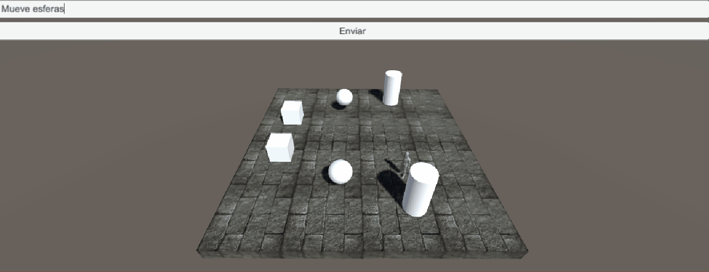
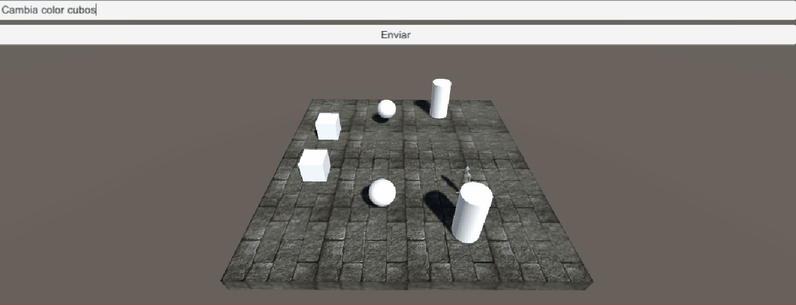

<h1>DialogFlow en Unity</h1>

Para esta práctica se nos ha pedido que utilicemos un agente conversacional en la escena, de forma que identifique en un diálogo con el personaje si los objetos de un tipo deben llevar a cabo alguna acción.

<h2>Configuración</h2>

El primer paso que llevamos a cabo fue descargar el paquete de inteligencia artificial de conversación gratuito (comúnmente llamado chatbot) creado por Google. Una vez descargado, entrenamos al bot con las posibles frases que podría decir el usuario y fijamos las respuetas válidas a las frases. También añadimos un GameController y un EventSystem a la escena.

<h2>Escena</h2>

La escena está compuesta por un suelo, un personaje controlable en tercera persona, un canvas, dos cubos, dos esferas y dos cilindros; además de los mencionados Gamecontroller y EventSystem. Todos estos elementos permiten al usuario interactuar con los objetos a través de texto y mediante el personaje. Escribiendo en el canvas el usuario puede interactuar con las esferas y los cubos. Esto es posible ya que el texto que es escrito por el usuario es enviado al chatbot que ya antes previamente hemos entrenado para que responda de forma específica a ciertas frases del usuario. Gracias a esto el usuario puede hacer que las esferas reboten o que los cubos cambien de color mediante texto. También utilizando el personaje el usuario puede interactuar con los cilindros, acercandose a estos la detección de la colision del personaje cambia el color de los cilindros. 

En los siguientes gifs se ven ilustrados las maneras en las que el usuario puede interactuar con la escena y sus repercusiones:

<h3>Esferas</h3>

Como mencionamos antes el jugador puede hacer moverse las esferas con texto:

<h3>Cubos</h3>
El jugador también puede cambiar el color de los cubos con texto

